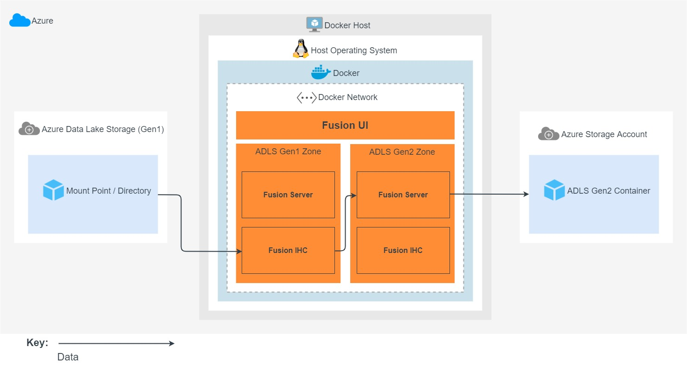

1. When initiating a migration, Fusion LiveMigrator will scan the ADLS Gen1 storage.
1. Any new files or differences are read by the Fusion IHC in the ADLS Gen1 zone, and replicated to the Fusion Server in the ADLS Gen2 zone.
1. The Fusion Server in the ADLS Gen2 zone will transform the ADLS Gen1 data to equivalent ADLS Gen2 changes. LiveMigrator will overwrite or skip existing files on the ADLS Gen2 storage depending on the settings used.
