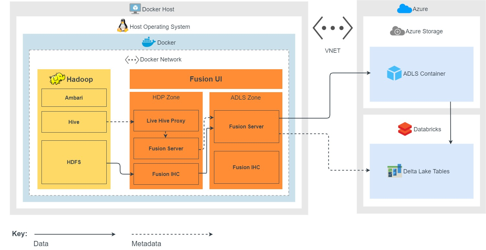

1. Live Hive Proxy will intercept and co-ordinate the Hive request with the Fusion Server on the HDP zone.
1. If the request is on a database/table that matches a Hive rule, the Fusion Server in the HDP zone will coordinate with the Fusion Server in the ADLS Gen2 zone (read requests are passed through to Hive). Metadata is replicated from the HDP zone to the ADLS Gen2 zone.
1. Any related HDFS data writes/changes are read by the Fusion IHC in the HDP zone, and replicated to the Fusion Server in the ADLS Gen2 zone.
1. The Fusion Server in the ADLS zone will transform the Hive metadata to equivalent changes on the Azure Databricks Delta Lake tables.
1. The Fusion Server in the ADLS zone will transform the HDFS data to equivalent ADLS Gen2 storage changes.
1. The ADLS Gen2 storage changes are then pushed to the Databricks cluster automatically through Fusion's ETL library (installed on the Databricks cluster).
