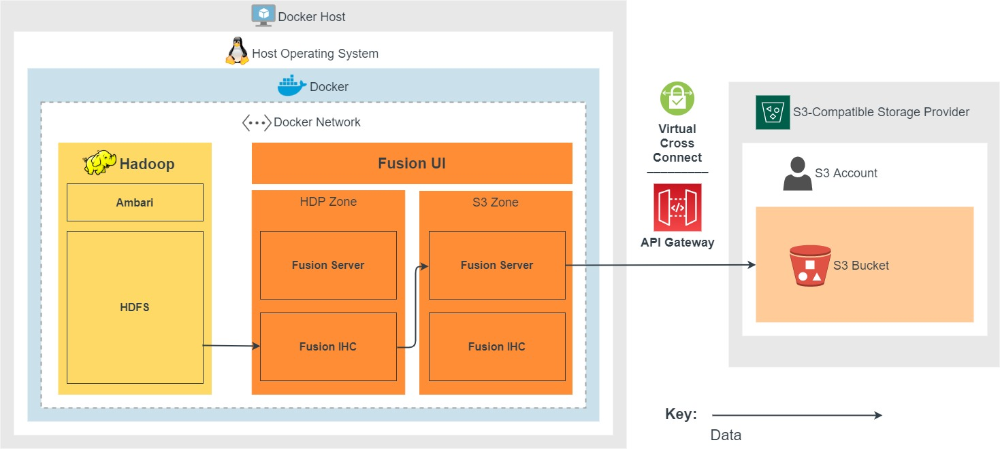

1. If a HDFS write request is on a path that matches a HCFS rule, the Fusion Server in the HDP zone will coordinate with the Fusion Server in the S3 zone (read requests are passed through to HDFS).
1. HDFS writes/changes are then read by the Fusion IHC in the HDP zone, and replicated to the Fusion Server in the S3 zone.
1. The Fusion Server in the S3 zone will transform the HDFS data to equivalent S3 bucket changes.
