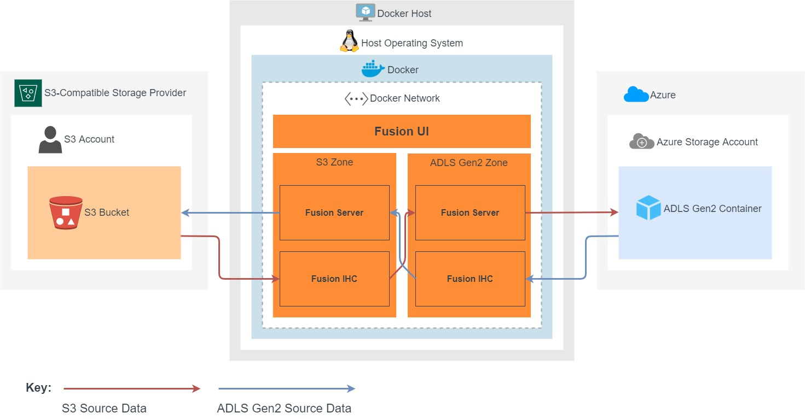

1. When initiating a migration, Fusion LiveMigrator will scan the S3 or ADLS Gen2 storage depending on which is selected as [source](../../glossary/s.md#source)).
1. Any new files or differences are read by the Fusion IHC in the source zone, and replicated to the Fusion Server in the [target](../../glossary/t.md#target) zone.
1. The Fusion Server in the target zone will transform the data to equivalent target storage changes. LiveMigrator will overwrite or skip existing files on the target storage depending on the settings used.
