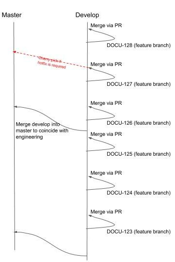
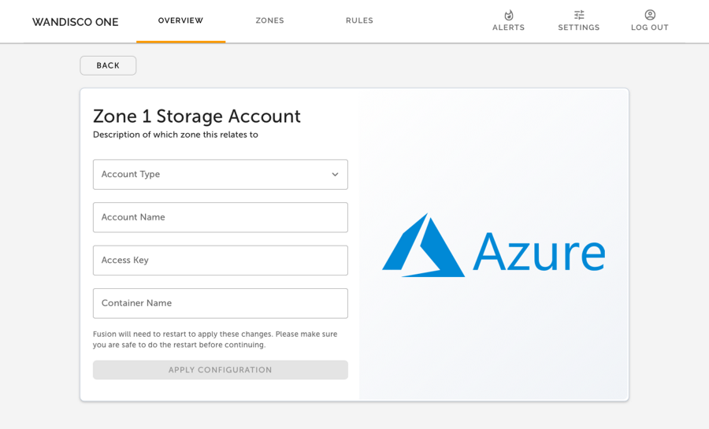
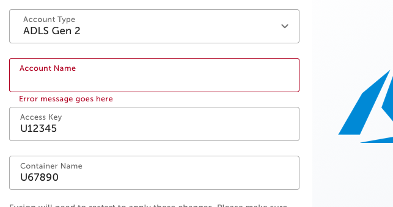

The docs are written in Markdown, if you're not familiar with this start here:
* https://guides.github.com/features/mastering-markdown/
* https://www.markdownguide.org/basic-syntax

We use [Docusaurus](https://docusaurus.io) to create the doc website - https://wandisco.github.io/wandisco-documentation

**Note for WANdisco staff**
The WANdisco GitHub docs are for the newer versions of products. This is currently those relating to the new UI, Docker and FRP. Other product documentation will gradually move here.
For changes to the older docs, please raise JIRA tickets as normal.
If unsure, please contact the docs team.

## Branching strategy

There are 2 main branches - master and develop.


Use feature branches from develop to make changes. Work is then reviewed and committed using [pull requests to the develop branch](https://help.github.com/en/github/collaborating-with-issues-and-pull-requests/proposing-changes-to-your-work-with-pull-requests).
Feature branches should be deleted when no longer required.

Develop will be merged into master to coincide with the engineering branches being promoted. With the help of UAT, ensure that nothing is put on to master that isn’t on engineering master.

If any emergency fixes are required, these can be done via feature branch/PR from develop and cherry-picked to master.

This only changes the [GitHub version of the docs](https://github.com/WANdisco/wandisco-documentation/tree/develop/docs), the docs team will control promoting to the [live/Docusaurus version](https://wandisco.github.io/wandisco-documentation/).




## What it should sound like
### Language
We use US English.

* Clear - must be easily understood by users.
* Concise - use as few words as possible.
* Correct - technically and grammatically correct .
* Current - the docs team rely on timely information from other teams to keep the docs up to date.
* Complete - info must be complete and if relevant give references to more information.
* Consistent - use consistent language and format.

Therefore, general guidelines for use of language are:

* Keep it short and simple - use short words, short sentences, short paragraphs, etc. Write in the simplest form to avoid confusing users.
* Use [active voice](https://www.grammarly.com/blog/active-vs-passive-voice/) - make the content user-centric. Address the user directly. Write as if the user has asked you how to do something.
* Use present tense - unless an action will happen in the future.
* Use terms and phrases consistently - technical writing is the opposite of creative writing in that you should repeat words rather than try to think of different words that mean the same thing.

### Specific words and phrases

Please use the following terms, punctuation etc for consistency.

| Correct   |    Variants (don't use)    |                
|----------|---------------|
| WANdisco Fusion or Fusion | WD Fusion   |
| On-premise | On premises, on premise |

#### Common misuses

There are a few common traps, take care to avoid them! A good example is when using _log in_ and _login_.

Correct - _Log in to your machine_

Incorrect - _Log into your machine_ or _Login to your machine_

For tips on correct hyphenation see https://grammartips.homestead.com/hyphens2.html.

### Variables
The format for variables used can be found here.
If there are any missing, please add them! https://wandisco.github.io/wandisco-documentation/docs/help/variables


## What it should look like

### Titles, sidebars and headings

For page titles and sidebar/ToC, use capital letters at the start of significant words. Prepositions such as 'of' and 'from' should be in lower case unless they begin the title.

Title/sidebar examples:
- Installation of WANdisco Fusion in Docker
- Create a Rule

For headers, capitalization rules are standard English.

Header examples:
- Live Hive activation
- Integrate LiveAnalytics with your Databricks cluster

Follow the style of existing quickstarts when deciding on subheadings.

### Capitalization and typefaces

#### Capitals

In general, follow the capitalization rules of standard English.

Try to keep your use of capital letters to a minimum.
* Don’t invent proper nouns when unnecessary, e.g. cluster manager (not Cluster Manager).
* Never use all uppercase for emphasis - use the sentence structure instead, or admonitions if necessary.

Follow capitalization guidelines or conventions for software or for a specific product or service as necessary. This can include case-sensitive keywords or product or service names with internal capitalization. For clarification, always check the official product documentation.

#### Bold
Use \*text\* to bold words in Markdown.

* Use bold to represent text seen on the screen/UI, but not terminal output or code.
* Do not bold words for emphasis.

#### Italic
Use \_text\_ to italicize words in Markdown.

* Used to highlight examples.
* Used for emphasis.

Use both of the above sparingly.

#### Monospace

Use \`text\` to monospace words in Markdown.

* Used to display code or terminal examples/output within a sentence.

  _Example_

  Use the `az login` to test Azure access via the command line.

* Used to display single line commands.

  _Example_

  Use the following commands:

  `cd /my/directory`

  `./my-script.sh`

* Used for hostname examples.

  Example

  `docker_host01.example.com`

#### Code snippets

Use \```content\``` to enclose multiple lines into a code snippet.

* Used to show the output of a terminal command.

  _Example_

  If successful, you will see that the following within the output below:

  ```
  < HTTP/1.1 100 Continue
  < HTTP/1.1 200 OK
  ```

* Used for multi-line commands (such as a Hive table create). To give the code type, e.g. sql, json, bash, text, use e.g. \```sql

  _Example_

  Create a table inside this database:

  ```sql
  CREATE TABLE databricks_demo.customer_addresses_dim_hive
  (
    Customer_Address_ID  bigint,
    Customer_ID          bigint,
    Valid_From_Timestamp timestamp,
    Valid_To_Timestamp   timestamp,
    House_Number         string,
    Street_Name          string,
    Appt_Suite_No        string,
    City                 string,
    State_Code           string,
    Zip_Code             string,
    Zip_Plus_Four        string,
    Country              string,
    Phone_Number         string
  )
  stored as ORC;
  ```

#### Admonitions
Use very sparingly! If there are too many used then none will stand out.

You can create a box around your text using a faux-table, which works as a warning or important note.

_Example_

```
| WARNING: If you run this you will lose your entire environment. |
| --- |
```

Renders as:

| WARNING: If you run this you will lose your entire environment. |
| --- |

### Formatting
#### Numbered lists

* Avoid substeps where possible but they can be used if there are two options for the same step.
* Do not breakdown steps too far but they do need to be clear.
* Do not have very specific and obvious steps for example, 'Click create'.
The docs should be supporting the product but if really basic things are not obvious, please raise a product improvement instead of using the doc to cover for the product.

The formatting difficulty is that you must indent text within your numbered steps to be in line with the text above.

_Correct formatting_
```text
1. The beginning of a step.

   This is inline with the first letter of the step.

2. Second step.

   This is inline with the first letter of the step.
```

_Incorrect formatting_
```text
1. The beginning of a step.

This is not inline with the first letter of the step.

2. Second step.

  This is also not inline with the first letter of the step.
```

#### Unordered list

Use these if there is no order or priority to the list items.
The same formatting concerns as above apply.

You can add unordered lists into a numbered step.

_Example_
```text
1. Beginning of a step.

   * unordered item 1
   * unordered item 2
```

#### Tables
Tables can be a good way of displaying a variety of options for a script or describing multiple properties within a file.
However please review each table as they don't always work, especially if there is large amounts of text.

_Example_
```text
| Option   | Example       | Description               |
|----------|---------------|---------------------------|
| Option 1 | `example1`    | Option 1 does this.       |
| Option 2 | `example2`    | Option 2 does this.       |
| Option 3 | `example3`    | Option 3 does this.       |
```
The pipes and dashes do not actually have to be in alignment for the table to format correctly.

See the tables generator link for further examples: https://www.tablesgenerator.com/markdown_tables

#### Numbers
Generally, one to nine written in full and larger numbers as numerical but there are exceptions! See https://style.ons.gov.uk/category/house-style/numbers/ for details.

* Keep numbers and their units together (that is, no space between them) e.g. 32KB
* In lists keep numbers and their units together e.g. 16-bit and 32-bit, not 16- and 32-bit
* Use a normal dash for number ranges, e.g: 12-19.


### Links

If moving a page or removing a subsection, ensure you update any affected links.

Links are very useful as they help reduce duplication and add detail without making a doc too long.
If you link externally, link to the official documentation where possible.

The on-screen text must indicate where the link will take you and not just be 'this section' etc.

_External link example_
```text
See the [Databricks documentation](https://docs.databricks.com/) for more info.
```

_Internal link example_
```text
See the [create a rule](../operation/create-rule.md) section for details.
```
In this example the doc is `/docs/quickstarts/installation/document.md` and is referencing `/docs/quickstarts/operation/create-rule.md`.
`.md` is required for links to work in the GitHub view. They are automatically removed in the Docusaurus version.


_Same page example_
```text
See the [Info you will need](#info-you-will-need) section for reference.
```
This example links to a header within the same document. Any spaces in the header will need to be replaced with a hyphen, prefixed with #.

See https://www.markdownguide.org/basic-syntax/#links or https://v2.docusaurus.io/versions#referencing-other-documents for more info.

### Images

All images should be hosted internally as externally hosted images may move or be deleted.

Images are stored in `/docs/assets/` for docs or `/website/static/img/` for the website.

_Example_

Use:
```

```
If:

Document location example: `/docs/quickstarts/installation/document.md`

Screenshot location example: `/docs/assets/screenshot.png`

#### Screenshots

Use only when absolutely necessary, the UI should be clear enough. Using screenshots also greatly increases the effort needed to keep the docs up to date.

If they are required then screenshots should give good context of the whole screen and not be a small zoomed in portion.
Use dev tools to remove any potentially sensitive info.

_Good example_
```

```


_Bad example_



#### Diagrams
These should be used alongside architectural sections, or to illustrate the workflow of a product.

They should be used to help explain a concept further, and not used as a substitute for the subject matter.

Follow the style of existing diagrams e.g. https://docs.wandisco.com/bigdata/wdfusion/2.15/images/single-namenode-proxy-per-zone.png

Save the diagrams in `/docs/assets/`.

### Downloadable files

Links to downloadable files that are hosted on this website can save the user from copy/pasting a large amount of text.

_Example code_

```text
<a id="cloud-init.txt" href="https://github.com/WANdisco/wandisco-documentation/raw/master/docs/assets/cloud-init.txt">cloud-init.txt</a>
```

_Example output_

<a id="cloud-init.txt" href="https://github.com/WANdisco/wandisco-documentation/raw/master/docs/assets/cloud-init.txt">cloud-init.txt</a>

All files should be placed inside of `/docs/assets/` on the master branch (i.e. create a feature branch from master when adding a file).
This is so that the raw link to the downloadable file does not have to be updated between different branches.

## Other

### Redirects
Only use if absolutely necessary, for example if you have publicly shared a link but then need to move the location of the specific document.

Add the following html to an `.md` file at the location you want to redirect from.

```
<!DOCTYPE html>
<html lang="en-US">
  <head>
    <meta charset="UTF-8" />
    <meta
      http-equiv="refresh"
      content="0; url=installation/document.html"
    />
    <script type="text/javascript">
      window.location.href = 'installation/document.html';
    </script>
    <title>WANdisco Documentation</title>
  </head>
  <body>
    If you are not redirected automatically, follow this
    <a href="installation/document.html">link</a>.
  </body>
</html>
```
Location of the redirect: `/docs/quickstarts/document.md`

Destination of the redirect: `/docs/quickstarts/installation/document.html`
